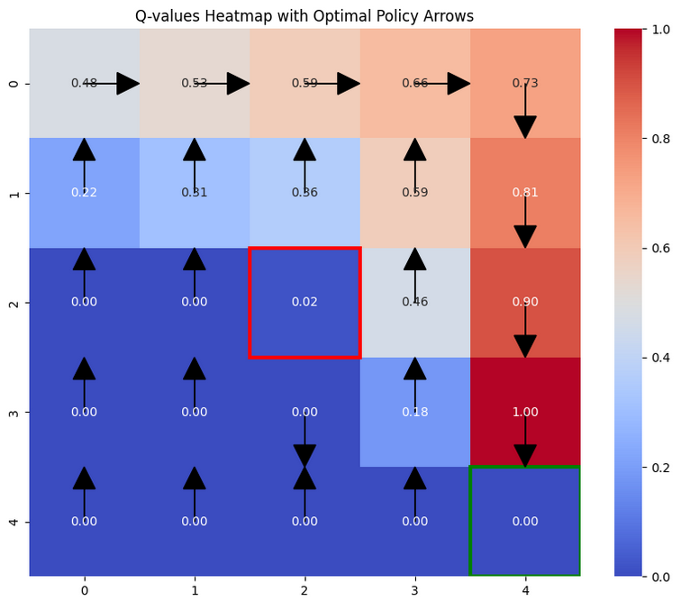

# Reinforcement Learning (Q-table) Implementation

## Problem Setup: Gridworld

- The agent starts in a specific position on a grid and must reach a goal position.
- The grid contains obstacles that the agent must avoid.
- The agent can move in four directions: **up**, **down**, **left**, or **right**.
- The agent receives rewards:
  - `+1` for reaching the goal.
  - `-1` for hitting an obstacle.
  - `0` for moving through empty space.

---

## Grid Definition

We define a **5 × 5 grid** with:
- **Start position** at the **top-left**.
- **Goal position** at the **bottom-right**.
- An **obstacle** in the **center** of the grid.

> This image shows a 5x5 grid with "Start" in the top-left cell and "Goal" in the bottom-right cell. One cell in the center is shaded blue. The grid is composed of equal-sized squares divided by black lines.

---

## Rewards

- `+1` for reaching the goal.
- `-1` for hitting the obstacle.
- `0` for moving through empty space.

---

## Q-values Table

- A **3D array** that stores Q-values for each **state-action** pair.
- All Q-values are initialized to **0**.
- Updated using the **Q-learning formula** during training.

---

## Epsilon-Greedy Policy

- The agent chooses actions by:
  - **Exploring**: selecting a random action with probability ε.
  - **Exploiting**: selecting the action with the **highest Q-value** with probability `1 - ε`.

---

## Q-value Update Rule

Q-values are updated using the **Q-learning equation** at every step:

Q(s, a) ← Q(s, a) + α [r + γ max_a' Q(s', a') - Q(s, a)]

Where:
- `Q(s, a)`: Q-value for state `s` and action `a`
- `α`: learning rate
- `γ`: discount factor
- `r`: reward
- `s'`: next state
- `a'`: next possible action

---

## Visualization

### Q-values Heatmap

- Visualizes the **maximum Q-value** across all actions for each state.
- Helps to understand how much the agent **values each state**.
- The **goal state** has the **highest value**, and the **obstacle** has a **low value**.

### Learned Policy

- Shows the **best action** to take from each state (i.e., the action with the highest Q-value).
- Represented using **arrows** pointing in the direction of the best move.
- Demonstrates how the agent **navigates from start to goal**, avoiding obstacles.

---

## Results

### Q-values Heatmap
- Shows **high values** near the **goal state**.
- **Low values** near the **obstacle**.

### Learned Policy
- Guides the agent from **start** to **goal** while avoiding the obstacle.
- **Arrows** indicate the best action at each state.

---

## 📊 Example: Q-values Heatmap
